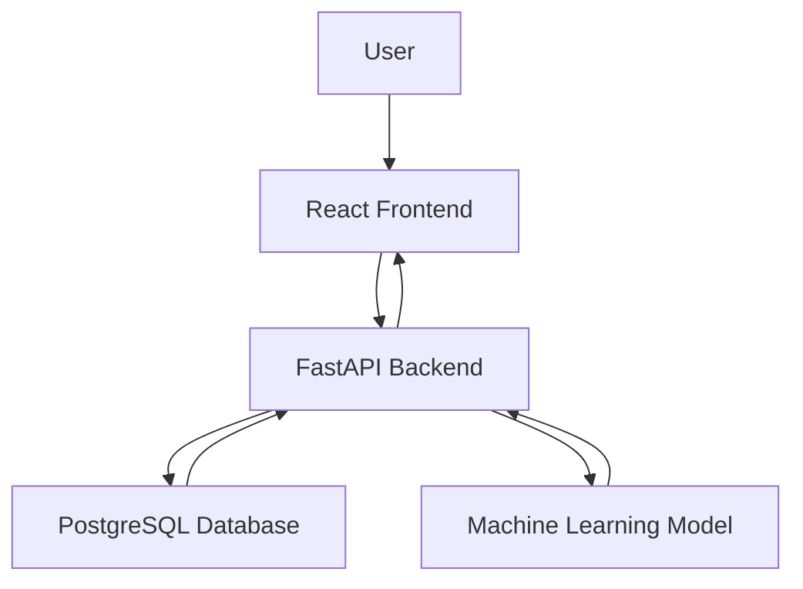
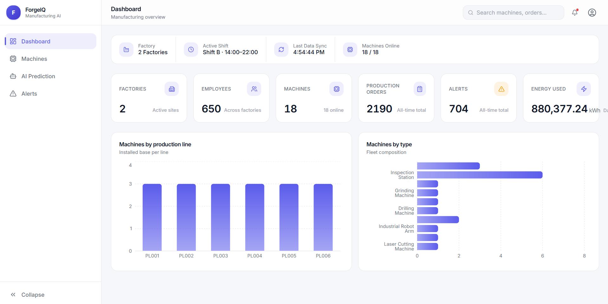
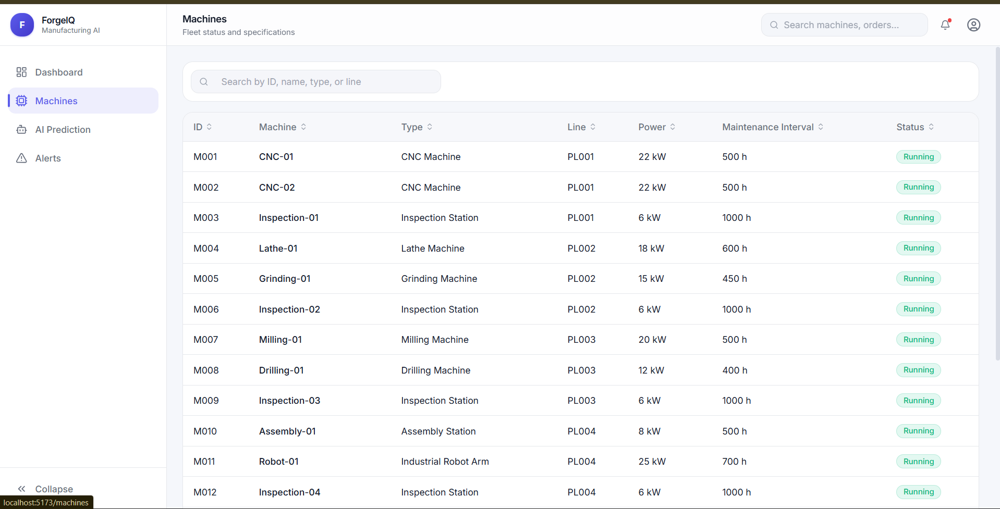
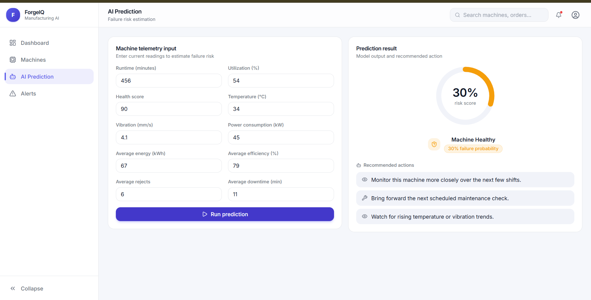
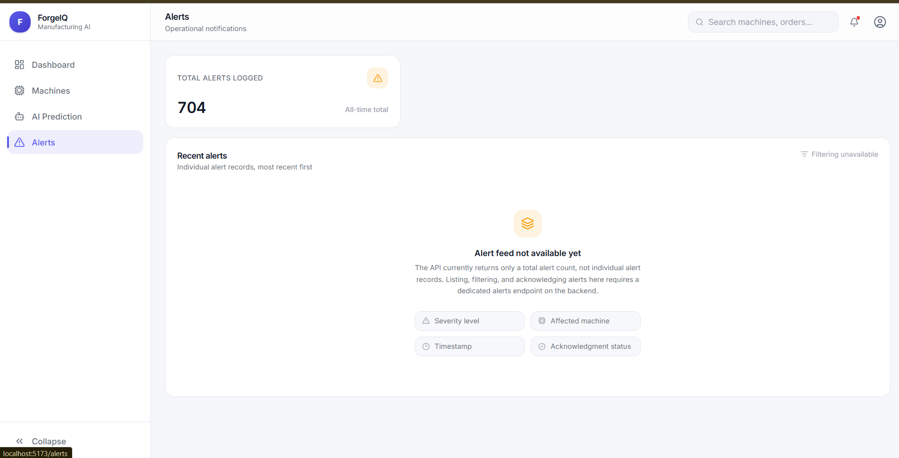

# ForgeIQ – Manufacturing AI Platform

ForgeIQ is a full-stack manufacturing intelligence platform that combines a relational operations database, a machine learning failure-prediction model, and a modern web dashboard into a single system for monitoring industrial equipment.

The platform tracks factories, machines, production orders, and operational alerts across multiple manufacturing sites, and surfaces this data through a FastAPI backend and a React dashboard. A trained classification model estimates near-term failure risk from live machine telemetry, giving operators an AI-assisted view of equipment health alongside the raw operational metrics.

ForgeIQ was built as an end-to-end demonstration of applied AI in an industrial setting — from a normalized PostgreSQL schema and synthetic data generation pipeline, through model training and evaluation, to a production-styled frontend suitable for real manufacturing operations teams.

---

## Features

- **Manufacturing Dashboard** — Live operational summary (active factory, shift, last sync, machines online), fleet-wide KPIs, and machine distribution charts.
- **Machine Monitoring** — Searchable, sortable fleet table with machine specifications, production line assignment, and live status.
- **AI Failure Prediction** — Interactive form for submitting machine telemetry and receiving a model-generated failure risk score with recommended actions.
- **Alerts Monitoring** — Centralized view of logged operational alerts across all factories.
- **PostgreSQL Database** — Normalized schema covering organization, workforce, manufacturing, inventory, procurement, quality, and energy domains.
- **REST API** — FastAPI backend exposing factory, machine, dashboard, and prediction endpoints with auto-generated OpenAPI/Swagger documentation.
- **React Dashboard** — Single-page application built with React, React Router, and Tailwind CSS, communicating with the backend over REST.
- **FastAPI Backend** — Python backend serving structured JSON responses backed by SQL queries against PostgreSQL.
- **Machine Learning Model** — Trained classification model (scikit-learn / XGBoost) predicting equipment failure probability from operational telemetry.

---

## Architecture



---

## Tech Stack

| Layer | Technology |
|---|---|
| **Frontend** | React, React Router, Tailwind CSS, Recharts, Axios, Vite |
| **Backend** | FastAPI, SQLAlchemy, Uvicorn, Pydantic |
| **Database** | PostgreSQL |
| **Machine Learning** | scikit-learn, XGBoost, pandas, joblib |
| **Tools** | Vite, oxlint, Faker (synthetic data generation), python-dotenv |

---

## Project Structure

```
ForgeIQ/
├── api/
│   └── app/
│       ├── main.py                  # FastAPI application entrypoint
│       ├── database.py              # SQLAlchemy engine / DB connection
│       ├── ml_model.py              # Loads the trained failure model
│       ├── schemas.py               # Pydantic request/response models
│       └── routers/
│           ├── factories.py
│           ├── machines.py
│           ├── dashboard.py
│           └── predict.py
├── frontend/
│   ├── src/
│   │   ├── api/                     # Axios client + API service functions
│   │   ├── components/              # Sidebar, Header, KPICard, ChartCard, ui/
│   │   ├── layouts/                 # MainLayout
│   │   ├── pages/                   # Dashboard, Machines, Prediction, Alerts
│   │   └── styles/                  # Design system tokens (global.css)
│   ├── vite.config.js
│   └── package.json
├── database/
│   └── schema/                      # Numbered SQL schema files (01–10)
├── ml/
│   ├── data/                        # Feature engineering + dataset
│   ├── training/                    # Model training scripts
│   ├── evaluation/                  # Feature importance analysis
│   └── saved_models/                # Trained model artifact (.pkl)
├── scripts/
│   ├── generators/                  # Synthetic dataset generators
│   └── load_to_postgres.py          # Loads generated CSVs into PostgreSQL
├── data/
│   ├── raw/                         # Generated CSV datasets
│   └── metadata/                    # Reference JSON metadata
├── requirements.txt
└── docker-compose.yml
```

---

## Installation

### Prerequisites
- Python 3.10+
- Node.js 18+
- PostgreSQL 14+

### 1. Clone the repository
```bash
git clone https://github.com/sejalr28/ForgeIQ.git
cd ForgeIQ
```

### 2. Backend setup
```bash
pip install -r requirements.txt
```

### 3. Environment variables
Create a `.env` file in the project root and in `api/`:
```env
DATABASE_URL=postgresql+psycopg2://<user>:<password>@localhost:5432/forgeiq_db
```

### 4. Database setup
Create the database, then apply the schema:
```bash
createdb forgeiq_db
psql -d forgeiq_db -f database/schema/01_organization.sql
psql -d forgeiq_db -f database/schema/02_workforce.sql
psql -d forgeiq_db -f database/schema/03_manufacturing.sql
psql -d forgeiq_db -f database/schema/04_inventory.sql
psql -d forgeiq_db -f database/schema/05_procurement.sql
psql -d forgeiq_db -f database/schema/06_quality.sql
psql -d forgeiq_db -f database/schema/07_energy.sql
psql -d forgeiq_db -f database/schema/08_analytics.sql
```

### 5. Generate and load data
```bash
python3 scripts/generators/master_generator.py
python3 scripts/load_to_postgres.py
```

### 6. Train the ML model
```bash
python3 ml/data/feature_engineering.py
python3 ml/training/train_failure_model.py
```

### 7. Run the backend
```bash
cd api
uvicorn app.main:app --reload
```
API available at `http://localhost:8000` — Swagger docs at `http://localhost:8000/docs`.

### 8. Run the frontend
```bash
cd frontend
npm install
npm run dev
```
Frontend available at `http://localhost:5173`.

---

## API Endpoints

| Method | Route | Description |
|---|---|---|
| GET | `/` | API root / health message |
| GET | `/health` | Health check with database connectivity status |
| GET | `/factories/` | List all factories |
| GET | `/machines/` | List all machines with specifications and status |
| GET | `/dashboard/overview` | Aggregated dashboard metrics (factories, employees, machines, production orders, alerts, energy) |
| POST | `/predict/failure` | Predict machine failure risk from telemetry input |

---

## Screenshots

### Dashboard


### Machines


### AI Prediction


### Alerts


### Swagger API Docs


### Database Schema


---

## Future Improvements

1. Add a dedicated alerts endpoint returning individual alert records (severity, affected machine, timestamp, acknowledgment status) instead of a total count only.
2. Add CORS middleware to the FastAPI backend to support direct cross-origin deployment without a dev proxy.
3. Add authentication and role-based access control for multi-user factory environments.
4. Add pagination and server-side filtering to the machines and factories endpoints.
5. Expand model evaluation with cross-validation and track model versioning alongside the saved artifact.

---

## Resume Highlights

- Designed and built a full-stack manufacturing intelligence platform spanning PostgreSQL, FastAPI, React, and a trained ML model.
- Modeled a normalized relational schema across 8 operational domains (organization, workforce, manufacturing, inventory, procurement, quality, energy, analytics).
- Built a synthetic industrial dataset generation pipeline using Faker to simulate realistic multi-factory operations data.
- Engineered features from raw operational data and trained/evaluated classification models (Logistic Regression, Random Forest, XGBoost) for equipment failure prediction.
- Built a FastAPI REST backend with SQLAlchemy, serving structured JSON endpoints with auto-generated OpenAPI documentation.
- Developed a production-styled React dashboard with Tailwind CSS, React Router, and Recharts, including a reusable design system.
- Implemented an interactive AI prediction interface translating model output into a visual risk gauge and plain-language recommendations.
- Diagnosed and resolved cross-origin connectivity between a Vite-served frontend and a FastAPI backend using a development proxy.
- Practiced honest UX design by explicitly surfacing data/API limitations (e.g. alerts feed) instead of fabricating unavailable data.
- Followed an iterative, audit-driven development process: technical audit, targeted bug fixes, and incremental UI polish across the full stack.

---

## License

This project is licensed under the MIT License.